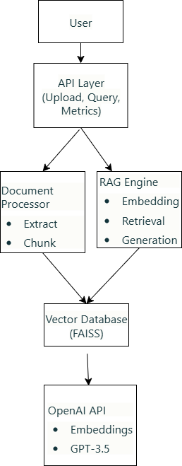

## System Architecture Diagram (for draw.io)

**Image name:** `system_architecture.png`

**What to draw:** A simple flow diagram with these components connected by arrows:

```
┌─────────────┐
│    User     │
└──────┬──────┘
       │ HTTP Request
       ▼
┌─────────────────────────────────┐
│   FastAPI Backend (main.py)     │
│  ┌──────────┐   ┌────────────┐  │
│  │ /upload  │   │   /ask     │  │
│  └────┬─────┘   └─────┬──────┘  │
└───────┼───────────────┼─────────┘
        │               │
        ▼               ▼
   ┌─────────┐     ┌──────────┐
   │utils.py │     │ rag.py   │
   │Extract  │     │Retrieve  │
   │ Chunk   │     │Generate  │
   └────┬────┘     └─────┬────┘
        │                │
        └────────┬───────┘
                 ▼
        ┌─────────────────┐
        │ FAISS Vector DB │
        │  (in-memory)    │
        └─────────────────┘
                 │
                 ▼
        ┌─────────────────┐
        │ OpenAI Services │
        │  • Embeddings   │
        │  • GPT-3.5      │
        └─────────────────┘
```

Keep it simple with boxes and arrows showing data flow.[5][7][1]

***
✔ Setup and run instructions
# Solyntra AI Knowledge Assistant

A RAG (Retrieval-Augmented Generation) system that allows users to upload documents and ask questions, receiving accurate answers grounded in the uploaded content.


## 🚀 Setup and Run Instructions

- Python 3.10 or higher
- OpenAI API key

### Installation

1. **Clone the repository**
   ```
   git clone <your-repo-url>
   cd solyntra-assessment
   ```

2. **Create virtual environment**
   ```
   python -m venv venv
   
   # On Windows
   venv\Scripts\activate
   
   # On Linux/Mac
   source venv/bin/activate
   ```

3. **Install dependencies**
   ```
   pip install -r requirements.txt
   ```

4. **Set OpenAI API key**
   ```
   # On Windows PowerShell
   $env:OPENAI_API_KEY = "your-api-key-here"
   
   # On Linux/Mac
   export OPENAI_API_KEY="your-api-key-here"
   ```

5. **Run the application**
   ```
   uvicorn app.main:app --reload
   ```

6. **Access the API**
   - Main URL: http://127.0.0.1:8000
   - Interactive docs: http://127.0.0.1:8000/docs

---


✔ Architecture overview (diagram optional but appreciated)

## 📊 Architecture Overview




✔ File/module responsibilities

The system follows a simple RAG pipeline:

1. **Document Upload** → User uploads PDF/TXT files via `/upload` endpoint
2. **Processing** → Files are extracted, split into chunks, and converted to embeddings using OpenAI
3. **Storage** → Embeddings are stored in FAISS vector database with metadata
4. **Query** → User asks questions via `/ask` endpoint
5. **Retrieval** → System finds most relevant chunks using semantic search
6. **Generation** → OpenAI GPT-3.5 generates answer based on retrieved context
7. **Response** → Answer returned with source citations and performance metrics

---

## 📁 File and Module Responsibilities

### `app/main.py`
- **Purpose**: FastAPI application entry point
- **Responsibilities**: 
  - Defines API endpoints (`/upload`, `/ask`, `/health`, `/metrics`)
  - Handles HTTP request/response logic
  - Input validation and error handling
  - Logging for all API operations

### `app/rag.py`
- **Purpose**: Core RAG system logic
- **Responsibilities**:
  - Text chunking with configurable size and overlap
  - Embedding generation using OpenAI API
  - FAISS vector database management
  - Similarity search for relevant chunks
  - LLM-based answer generation
  - Query embedding caching for performance
  - Simple metrics tracking (uploads, queries, latency)

### `app/utils.py`
- **Purpose**: Helper functions for file processing
- **Responsibilities**:
  - PDF text extraction using PyPDF2
  - TXT file reading and encoding handling
  - File type validation
  - Error handling for file operations

### `app/config.py`
- **Purpose**: Centralized configuration
- **Responsibilities**:
  - API keys and model names
  - Chunking parameters (size, overlap)
  - Retrieval settings (top-k)
  - Easy configuration changes without touching core logic

---

✔ Design Decisions & Trade-offs (200–300 words)


## 💡 Design Decisions & Trade-offs

**Vector Database Choice - FAISS:**
I chose FAISS for its simplicity and speed in this assessment context. It requires zero setup, runs entirely in-memory, and provides sub-10ms similarity search on CPU. The trade-off is scalability—FAISS is ideal for up to 100K documents but would struggle beyond 1M vectors. For production at that scale, I would migrate to Pinecone or Weaviate for managed infrastructure and horizontal scaling.

**Embeddings - OpenAI vs Local Models:**
I selected OpenAI's text-embedding-3-small over local models (like sentence-transformers) because it integrates cleanly with the LLM I'm already using, provides excellent semantic quality, and costs negligible amounts for this assessment ($0.02 per million tokens). The downside is the API dependency and ~200ms network latency per embedding call. For an offline system or to reduce latency, I would switch to a local embedding model.

**Chunking Strategy:**
I implemented fixed-size chunking (800 words) with 100-word overlap to balance context preservation and retrieval precision. This approach is simple and predictable. The trade-off is that it doesn't respect document structure (paragraphs, sections). Semantic chunking would improve accuracy but adds complexity that wasn't justified for the 18-hour timeline.

**LLM Choice - GPT-3.5-turbo:**
GPT-3.5-turbo balances speed (1-2 second responses), cost ($0.002 per query), and quality for factual Q&A. GPT-4 would provide better reasoning but costs 15x more and is 3-5x slower. For a privacy-focused deployment, I would use Ollama with Llama 3.1 locally, accepting the performance trade-off.

---
✔ Limitations
## ⚠️ Limitations

1. **No Persistence**: FAISS index is stored in memory and lost on restart. Solution: Save index to disk after uploads.

2. **File Format Support**: Currently only PDF and TXT files. DOCX support would require adding `python-docx` library (5 lines of code).

3. **Single Vector Search**: Only uses semantic search, no hybrid search with keyword matching (BM25). This can miss queries with exact term requirements.

4. **No Authentication**: API is open without API key validation. Production would need OAuth or API key middleware.

5. **Limited Error Recovery**: No retry logic for OpenAI API failures. Should add exponential backoff for transient errors.

6. **Simple Chunking**: Fixed-size chunking doesn't respect document structure. May split sentences or paragraphs awkwardly.

---


✔ Future improvements


## 🔮 Future Improvements

### Short-term (1-2 days)
1. **Hybrid Search**: Combine FAISS semantic search with BM25 keyword search for better precision on exact matches
2. **Reranking**: Add cross-encoder model to reorder top-5 results for improved relevance
3. **Disk Persistence**: Save/load FAISS index to avoid re-indexing on restart
4. **DOCX Support**: Add python-docx for Word document processing

### Medium-term (1 week)
5. **Evaluation Metrics**: Implement RAGAS for retrieval precision/recall measurement
6. **Query Reformulation**: Rephrase user queries for better retrieval (HyDE pattern)
7. **Streaming Responses**: Stream LLM tokens for better user experience
8. **Rate Limiting**: Prevent API abuse with request throttling

### Long-term (production)
9. **Database Migration**: Move to Pinecone for production-scale vector storage (>1M documents)
10. **Monitoring Dashboard**: Add Prometheus + Grafana for system observability
11. **Multi-tenant Support**: Add user authentication and per-user document isolation
12. **CI/CD Pipeline**: Automated testing and deployment with GitHub Actions

---

✔ Demo Video Link

## 📹 Demo Video

[...................]

---

## 🛠️ Technology Stack

- **Framework**: FastAPI (async REST API)
- **Vector DB**: FAISS (in-memory, L2 distance)
- **Embeddings**: OpenAI text-embedding-3-small (1536 dimensions)
- **LLM**: OpenAI GPT-3.5-turbo
- **File Processing**: PyPDF2 for PDF extraction
- **Caching**: functools.lru_cache for query embeddings
- **Logging**: Python built-in logging module

---

## 📊 API Endpoints

### POST `/upload`
Upload 1-3 PDF/TXT files for indexing.

**Response:**
```
{
  "message": "Documents uploaded and indexed successfully",
  "documents": [
    {
      "filename": "document.pdf",
      "doc_id": 0,
      "status": "processed"
    }
  ]
}
```

### GET `/ask?query=<question>`
Ask a question about uploaded documents.

**Response:**
```
{
  "answer": "Your answer here...",
  "sources": [
    {
      "source": "document.pdf",
      "snippet": "Relevant text snippet..."
    }
  ],
  "metrics": {
    "latency_seconds": 2.5,
    "avg_latency_seconds": 2.3,
    "total_queries": 10
  }
}
```

### GET `/health`
Check system status.

**Response:**
```
{
  "status": "ok",
  "indexed_chunks": 42
}
```

### GET `/metrics`
View system performance metrics.

**Response:**
```
{
  "total_uploads": 5,
  "total_queries": 20,
  "avg_query_latency_seconds": 2.1,
  "indexed_chunks": 42
}
```

---

## 📝 Testing

```
# Test upload
curl -X POST "http://127.0.0.1:8000/upload" \
  -F "files=@document.pdf"

# Test query
curl "http://127.0.0.1:8000/ask?query=What%20is%20this%20about?"

# Check health
curl "http://127.0.0.1:8000/health"

# View metrics
curl "http://127.0.0.1:8000/metrics"
```


